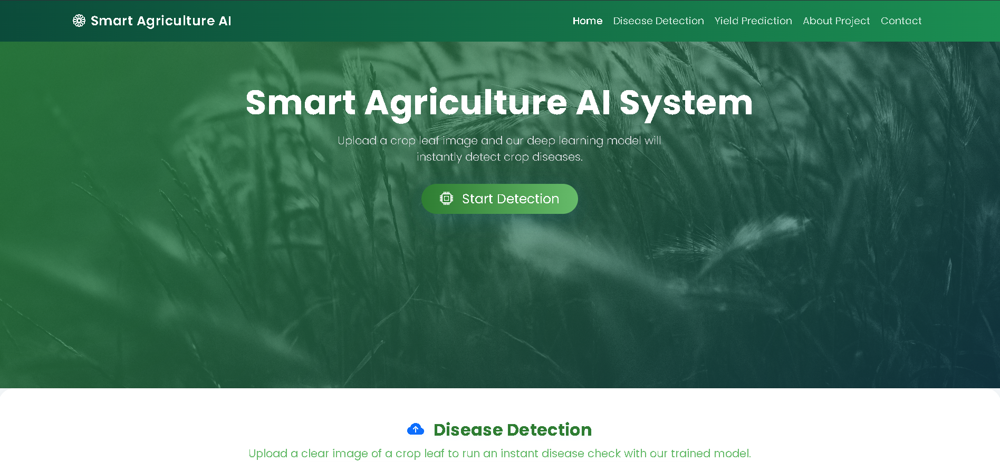
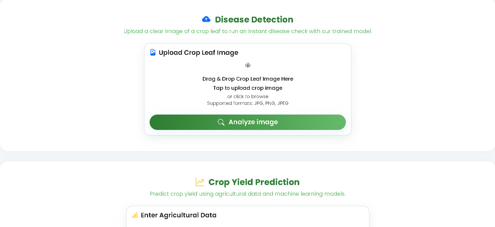
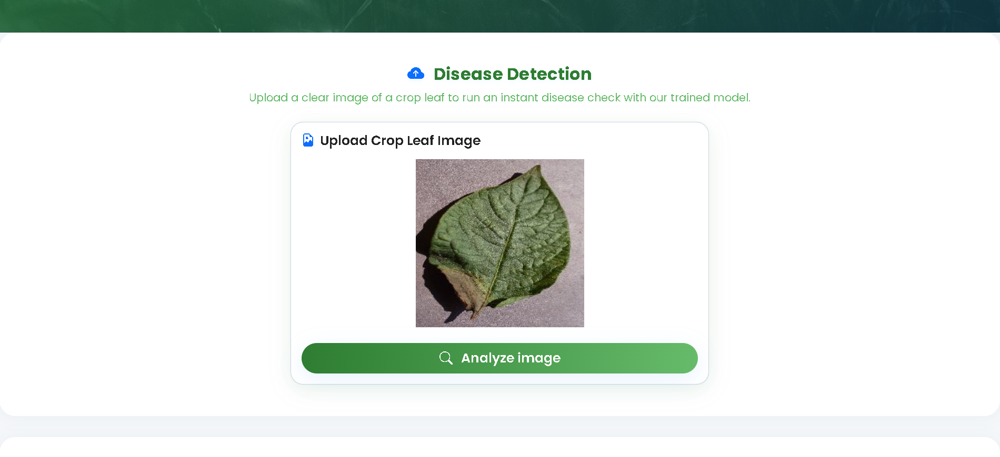
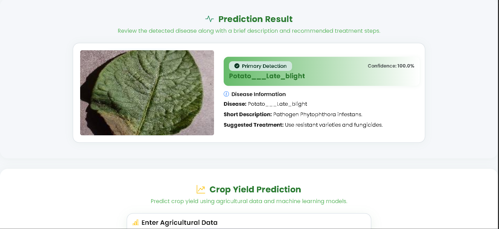
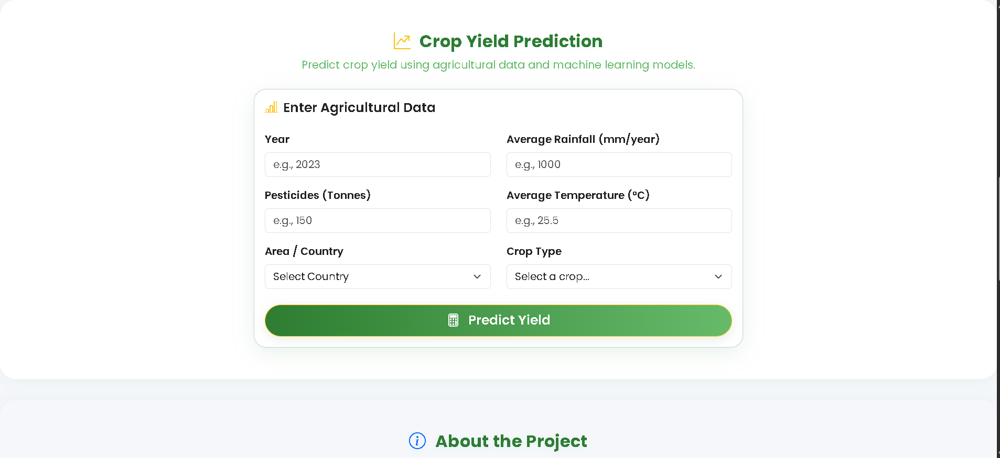
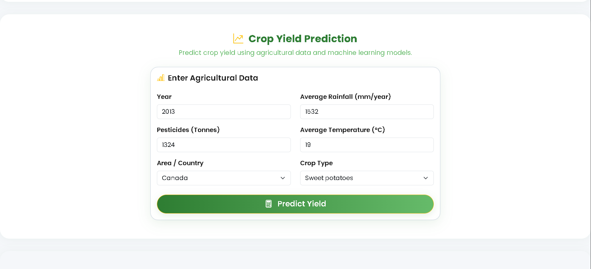
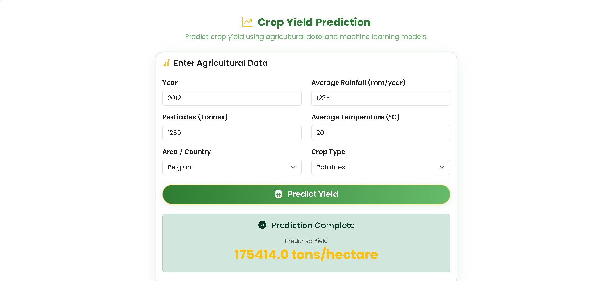

# 🌾 AI-Based Crop Disease Detection & Yield Prediction System

## 🚀 Project Overview

This project is a full-stack AI-powered web application designed to assist farmers and agricultural stakeholders by providing:

* 🦠 **Crop Disease Detection** using Deep Learning (EfficientNet)
* 📊 **Crop Yield Prediction** using Machine Learning (Lasso, Decision Tree Regressor)

The system enables early disease identification and data-driven decision-making to improve agricultural productivity.

---

## 🎯 Key Features

### 🦠 Disease Detection

* Upload crop leaf images
* Detect diseases using EfficientNet model
* High accuracy image classification

### 📊 Yield Prediction

* Predict yield based on:

  * Temperature
  * Rainfall
  * Soil conditions
  * Crop type
* Uses Lasso Regression & Decision Tree Regressor

### 🌐 User Interface

* Simple and intuitive UI
* Image upload support
* Dropdown-based crop selection

---

## 🛠️ Tech Stack

| Category | Technology                                    |
| -------- | --------------------------------------------- |
| Frontend | HTML, CSS, JavaScript                         |
| Backend  | Python (Flask)                                |
| ML/DL    | TensorFlow, Keras, Scikit-learn               |
| Models   | EfficientNet, Lasso,  Decision Tree Regressor |

---

## 📸 Screenshots









Example:

* Disease Detection Page
* Yield Prediction Page
* Output Results

---

## ⚙️ Installation & Setup

```bash
git clone https://github.com/your-username/Crop-Disease-Detection-and-Yield-Prediction.git
cd Crop-Disease-Detection-and-Yield-Prediction
```

```bash
pip install -r requirements.txt
```

```bash
python app.py
```

---

## 📂 Model Files

⚠️ Due to GitHub size limitations, trained models are not included.

👉 Download models from:

[here](https://drive.google.com/drive/folders/13GlLpLbDBxZPxQCODfUNY3FALXF51VJd?usp=drive_link)

After downloading, place them inside:

```
models/
```

---

## 📈 How It Works

### Disease Detection

1. User uploads leaf image
2. Image is preprocessed
3. EfficientNet model predicts disease class

### Yield Prediction

1. User inputs environmental parameters
2. Data is processed
3. ML model predicts expected yield

---

## 📊 Results

* High accuracy in disease classification
* Reliable yield prediction using ensemble methods

---

## ⚠️ Limitations

* Limited to trained crops and diseases
* Model performance depends on dataset quality
* Requires internet/browser environment

---

## 🔮 Future Scope

* Mobile application
* Real-time weather API integration
* More crop and disease coverage
* Multilingual support for farmers

---

## 👨‍💻 Author

**Mohd Faiz Ansari**

---

## ⭐ If you like this project

Give it a star ⭐ on GitHub!
